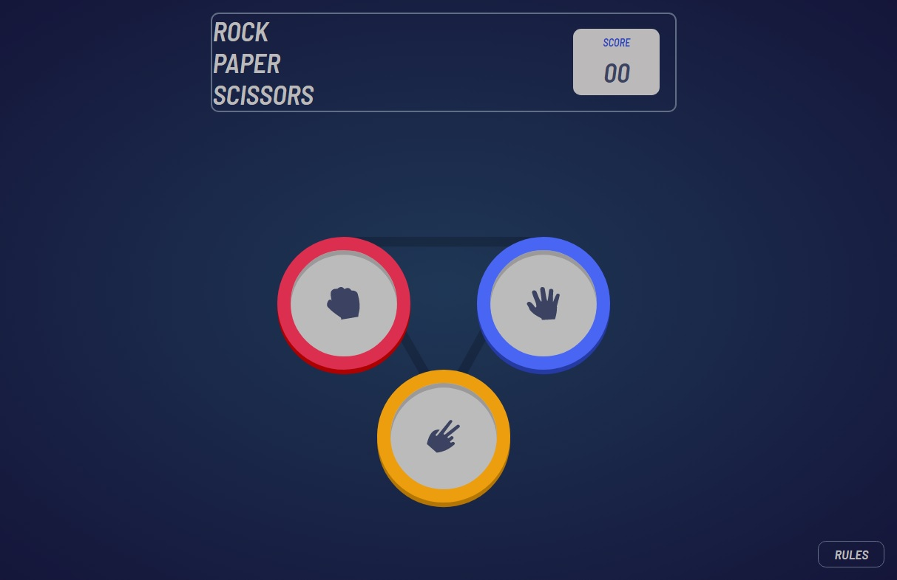

#   Rock, Paper, Scissors

This is a solution to the [Rock, Paper, Scissors challenge on Frontend Mentor](https://www.frontendmentor.io/challenges/rock-paper-scissors-game-pTgwgvgH). Frontend Mentor challenges help you improve your coding skills by building realistic projects. 

## Table of contents

  - [The challenge](#the-challenge)
  - [Screenshot](#screenshot)
  - [Links](#links)
  - [Rules](#rules)
  - [Original](#original)
  - [Built with](#built-with)

### The challenge

Users should be able to:

- View the optimal layout for the game depending on their device's screen size
- Play Rock, Paper, Scissors against the computer
- Reset the score after refreshing the browser 

### Rules

If the player wins, they gain 1 point. If the computer wins, the player loses one point.

#### Original

- Paper beats Rock
- Rock beats Scissors
- Scissors beats Paper

### Screenshot

### Links

- Solution URL: [solution](https://github.com/laminejuve/rockPaperScissors)
- Live Site URL: [live Demo](https://laminejuve.github.io/rockPaperScissors/)

### Built with

- Semantic HTML5 markup
- CSS custom properties
- Flexbox
- JavaScript

